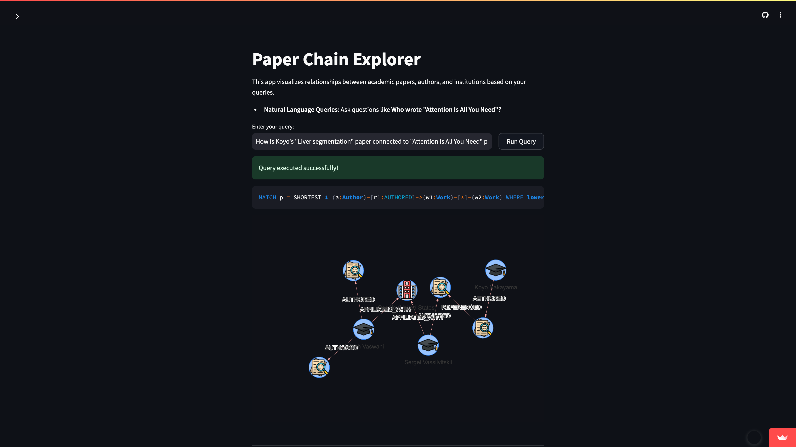

**English** | [日本語](#paperchainexplorer-1)
# PaperChainExplorer

**An interactive graph-based application to explore academic paper connections.**  
PaperChainExplorer helps researchers, students, and academic professionals visualize and analyze the relationships between academic papers, authors, and institutions. With an easy-to-use interface, users can explore citation chains and co-authorships within the research domain.

> **Note:** The concept of "topics" has not yet been integrated into the application. It is planned as a future enhancement.

## 🧙‍♂️ Inspiration
Inspired by the idea of uncovering hidden connections in academic research, this project seeks to help researchers and students rediscover forgotten ideas and foster innovation.

## 🚀 Features
- Visualize relationships between academic papers, authors, and (future) topics with interactive graphs.
- Query paths between papers (e.g., "How is my paper connected to the Transformer paper?").
- Explore citation networks and shared authorships interactively.
- Simple and intuitive user interface built with **Streamlit**.
- Wondering if your *mediocre* paper connects to a groundbreaking one like *"Attention Is All You Need"*? PaperChainExplorer helps uncover these surprising relationships.

### 📸 Demo Screenshot


## 🛠️ Tech Stack
- **Backend**: Python - Handles application logic, integrates with Neo4j, and fetches data from external sources.
- **Database**: Neo4j - Graph database used to store and query relationships between academic papers, authors.
- **Frontend**: Streamlit - Provides an interactive user interface for visualizing the graph and performing queries.
- **APIs**: OpenAlex API - Fetches data on academic papers, authors, and institutions for use in the application.

## 📂 Project Structure
```
paper-chain-explorer/
├── data/                  # (Unused) Scripts to fetch and preprocess data from OpenAlex API
├── src/                   # Core application code
│   ├── locales/           # Translation files
│   │   ├── en.json        # English translations
│   │   └── ja.json        # Japanese translations
│   ├── setup_database.py  # Database setup scripts for Neo4j
│   ├── app.py             # Main Streamlit app entry point
│   ├── config.py
│   ├── graph.py           # (Unused) Functions for interacting with Neo4j
│   └── visualize.py       # (Unused) Logic for graph visualization in Streamlit
├── queries/               # (Unused) Predefined Cypher queries for common operations
├── notebooks/             # (Unused) Jupyter notebooks for prototyping and experimentation
├── tests/                 # Unit tests for backend and frontend functionality
├── docs/                  # Documentation for users and developers
├── .gitignore             # Git ignore rules
├── requirements.txt       # Python dependencies
└── README.md              # Project overview
```
> **Note:** The following files and directories are currently unused but are included for future development:
> - `data/`
> - `src/graph.py`
> - `src/visualize.py`
> - `queries/`
> - `notebooks/`

## 🧩 Deployment
To deploy the app to your own server, follow these steps:

1. Clone the repository:
   ```bash
   git clone https://github.com/koyonkym/paper-chain-explorer.git
   ```
2. Set up the environment:
   ```bash
   cd paper-chain-explorer
   python -m venv venv
   source venv/bin/activate  # For Linux/Mac
   venv\Scripts\activate     # For Windows
   pip install -r requirements.txt
   ```
3. Set up a Neo4j instance (locally or in the cloud) and configure the connection.

4. Set up the following environment variables:
   - `NEO4J_URI` - URI of the Neo4j instance.
   - `NEO4J_USERNAME` - Username for Neo4j authentication.
   - `NEO4J_PASSWORD` - Password for Neo4j authentication.
   - `OPENALEX_EMAIL` - Email address for OpenAlex API usage.
   - `OPENAI_API_KEY` - API key for OpenAI services.

   Example setup in Linux/Mac:
   ```bash
   export NEO4J_URI="bolt://localhost:7687"
   export NEO4J_USERNAME="neo4j"
   export NEO4J_PASSWORD="password"
   export OPENALEX_EMAIL="your-email@example.com"
   export OPENAI_API_KEY="your-openai-api-key"
   ```

5. Create the graph in the Neo4j database by running the following command:
   ```bash
   python src/setup_database.py
   ```
   This step fetches data from the OpenAlex API and populates the Neo4j database with the initial graph.

6. Start the Streamlit application:
   ```bash
   streamlit run src/app.py
   ```

## 🧪 Running Tests
To run the tests, use the following command:
```bash
pytest tests/
```
This will run all the unit tests located in the `tests/` directory.

## 🔍 Example Query
- "How is Paper A connected to Paper B?"
   - This query will visualize citation chains or shared authors between the two papers.

- "Who are the authors of the paper 'Attention Is All You Need'?"
   - This will retrieve and visualize the authorship relationship of the paper.

- "Find all papers related to 'Transformer models'"
   - **Future Work**: This query is not currently supported as the app does not use vector embeddings for semantic similarity. Currently, only citation-based connections are displayed. Enhancing the app to include this feature is planned for a future update.

## 🌐 Reference Web Pages
Here are the key resources used for data and development:
- [J535D165/pyalex: A Python library for OpenAlex (openalex.org)](https://github.com/J535D165/pyalex)
- [Introduction - Cypher Manual](https://neo4j.com/docs/cypher-manual/current/introduction/)
- [API Documentation — Neo4j Python Driver 5.27](https://neo4j.com/docs/api/python-driver/current/api.html)
- [GraphRAG for Python — neo4j-graphrag-python  documentation](https://neo4j.com/docs/neo4j-graphrag-python/current/index.html)
- [Streamlit documentation](https://docs.streamlit.io/)
- [ChrisDelClea/streamlit-agraph: A Streamlit Graph Vis](https://github.com/ChrisDelClea/streamlit-agraph)
- [Vector Icons and Stickers - PNG, SVG, EPS, PSD and CSS](https://www.flaticon.com/)

## 🌟 Contribution
We welcome contributions to improve PaperChainExplorer! Here are ways you can help:
- **Report bugs**: Open an issue describing the bug or error.
- **Suggest features**: Open an issue with new feature requests.
- **Submit code improvements**: Fork the repository, make your changes, and open a pull request.

## 📜 License
This project is licensed under the MIT License. See the [LICENSE](LICENSE) file for details.

## 📑 Attribution
This project uses icons provided by Flaticon. Below are the specific attributions:
- [Academic icons created by Slamlabs - Flaticon](https://www.flaticon.com/free-icons/academic)
- [Graduation hat icons created by Freepik - Flaticon](https://www.flaticon.com/free-icons/graduation-hat)
- [Institute icons created by vectorspoint - Flaticon](https://www.flaticon.com/free-icons/institute)

<br>
<br>
<br>

[English](#paperchainexplorer) | **日本語**
# PaperChainExplorer

**学術論文のつながりを探索するためのインタラクティブなグラフベースアプリケーション**  
PaperChainExplorer は、研究者や学生、学術専門家が、学術論文や著者、研究機関の間の関係を可視化し、分析することを支援します。使いやすいインターフェースによって、引用チェーンや共同著者の関係を研究分野内で探索できます。

> **注記:** 「トピック」の概念はまだアプリケーションに統合されていません。今後の機能拡張として計画しています。

## 🧙‍♂️ インスピレーション
このプロジェクトは、学術研究における隠れたつながりを明らかにするというアイデアに触発され、研究者や学生が忘れられたアイデアを再発見し、革新を促すことを目指しています。

## 🚀 機能
- 学術論文、著者、（将来的には）トピック間の関係をインタラクティブなグラフで可視化。
- 論文間の経路をクエリ（例：「私の論文は Transformer の論文とどのように繋がっていますか？」）。
- 引用ネットワークや共有著者関係をインタラクティブに探索。
- **Streamlit** を使用して構築されたシンプルで直感的なユーザーインターフェース。
- 私の*平凡な*論文が、「Attention Is All You Need」のような画期的な論文と繋がっているかどうか知りたいですか？PaperChainExplorerがこれらの驚くべき関係を明らかにします。

### 📸 デモスクリーンショット


## 🛠️ 技術スタック
- **バックエンド**: Python - アプリケーションロジックの処理、Neo4jとの統合、外部ソースからのデータ取得を実行。
- **データベース**: Neo4j - 学術論文、著者間の関係を保存し、クエリを実行するためのグラフデータベース。
- **フロントエンド**: Streamlit - グラフの可視化とクエリ実行のためのインタラクティブなユーザーインターフェースを提供。
- **API**: OpenAlex API - 学術論文、著者、研究機関に関するデータを取得し、アプリケーションで利用。

## 📂 プロジェクト構成
```
paper-chain-explorer/
├── data/                  # （未使用）OpenAlex API からデータを取得し、前処理するスクリプト
├── src/                   # コアアプリケーションコード
│   ├── locales/           # 翻訳ファイル
│   │   ├── en.json        # 英語翻訳
│   │   └── ja.json        # 日本語翻訳
│   ├── setup_database.py  # Neo4j のデータベースセットアップスクリプト
│   ├── app.py             # Streamlit アプリのエントリーポイント
│   ├── config.py
│   ├── graph.py           # （未使用）Neo4j とのやり取りのための関数
│   ├── visualize.py       # （未使用）Streamlit でのグラフ可視化のロジック
├── queries/               # （未使用）一般的な操作のための事前定義された Cypher クエリ
├── notebooks/             # （未使用）プロトタイピングと実験用の Jupyter ノートブック
├── tests/                 # バックエンドとフロントエンドの機能テスト
├── docs/                  # ユーザーや開発者向けのドキュメント
├── .gitignore             # Git のルール
├── requirements.txt       # Python の依存関係
└── README.md              # プロジェクトの概要
```

> **注記:** 以下のファイルとディレクトリは現在未使用ですが、将来の開発に使用予定です。
> - `data/`
> - `src/graph.py`
> - `src/visualize.py`
> - `queries/`
> - `notebooks/`

## 🧩 デプロイ
アプリをサーバーにデプロイする手順は次のとおりです：

1. リポジトリをクローン：
   ```bash
   git clone https://github.com/koyonkym/paper-chain-explorer.git
   ```

2. 環境をセットアップ：
   ```bash
   cd paper-chain-explorer
   python -m venv venv
   source venv/bin/activate  # Linux/Macの場合
   venv\Scripts\activate     # Windowsの場合
   pip install -r requirements.txt
   ```

3. Neo4j インスタンスをセットアップ（ローカルまたはクラウド上）し、接続を構成。

4. 以下の環境変数をセットアップ：
   - `NEO4J_URI` - Neo4j インスタンスの URI。
   - `NEO4J_USERNAME` - Neo4j の認証用ユーザー名。
   - `NEO4J_PASSWORD` - Neo4j の認証用パスワード。
   - `OPENALEX_EMAIL` - OpenAlex API の使用に必要なメールアドレス。
   - `OPENAI_API_KEY` - OpenAI サービス用の API キー。

   Linux/Mac での例：
   ```bash
   export NEO4J_URI="bolt://localhost:7687"
   export NEO4J_USERNAME="neo4j"
   export NEO4J_PASSWORD="password"
   export OPENALEX_EMAIL="your-email@example.com"
   export OPENAI_API_KEY="your-openai-api-key"
   ```

5. Neo4j データベースにグラフを作成：
   ```bash
   python src/setup_database.py
   ```
   このステップで OpenAlex API からデータを取得し、初期グラフを Neo4j データベースに作成します。

6. Streamlit アプリケーションを起動：
   ```bash
   streamlit run src/app.py
   ```

## 🧪 テスト実行
テストを実行するには、以下のコマンドを実行：
```bash
pytest tests/
```
これにより、`tests/` ディレクトリ内のすべての単体テストが実行されます。

## 🔍 クエリの例
- 論文 A と論文 B はどのようにつながっていますか？
   - このクエリは、引用チェーンや共同著者を可視化します。
- 「Attention Is All You Need」の著者は誰ですか？
   - このクエリは、論文の著者関係を取得し、可視化します。
- 「Transformer」に関連するすべての論文を見つけてください
   - **将来の機能**: このクエリは現在サポートされていません。アプリはベクトル埋め込みによる意味的な類似性を使用しておらず、引用ベースの接続のみを表示します。この機能の追加が将来のアップデートとして計画しています。

## 🌐 参考ウェブページ
データと開発で使用した主要リソースは次のとおりです：
- [J535D165/pyalex: A Python library for OpenAlex (openalex.org)](https://github.com/J535D165/pyalex)
- [Introduction - Cypher Manual](https://neo4j.com/docs/cypher-manual/current/introduction/)
- [API Documentation — Neo4j Python Driver 5.27](https://neo4j.com/docs/api/python-driver/current/api.html)
- [GraphRAG for Python — neo4j-graphrag-python  documentation](https://neo4j.com/docs/neo4j-graphrag-python/current/index.html)
- [Streamlit documentation](https://docs.streamlit.io/)
- [ChrisDelClea/streamlit-agraph: A Streamlit Graph Vis](https://github.com/ChrisDelClea/streamlit-agraph)
- [Vector Icons and Stickers - PNG, SVG, EPS, PSD and CSS](https://www.flaticon.com/)

## 🌟 貢献
PaperChainExplorer の改善への貢献を歓迎します！以下の方法でご協力いただけます：
- **バグの報告**: 問題を説明した Issue を作成してください。
- **機能の提案**: 新しい機能要求を Issue として投稿してください。
- **コード改善の提案**: リポジトリをフォークし、変更を加えてプルリクエストを作成してください。

## 📜 ライセンス
このプロジェクトは MIT ライセンスのです。詳細は [LICENSE](LICENSE) ファイルをご覧ください。

## 📑 帰属表示
このプロジェクトでは、Flaticon が提供するアイコンを使用しています。以下に具体的な帰属情報を記載します。
- [Slamlabs によって作成された学術アイコン - Flaticon](https://www.flaticon.com/free-icons/academic)
- [Freepik によって作成された卒業帽アイコン - Flaticon](https://www.flaticon.com/free-icons/graduation-hat)
- [vectorspoint によって作成された施設アイコン - Flaticon](https://www.flaticon.com/free-icons/institute)
